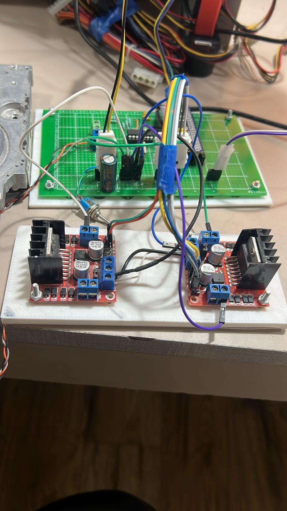
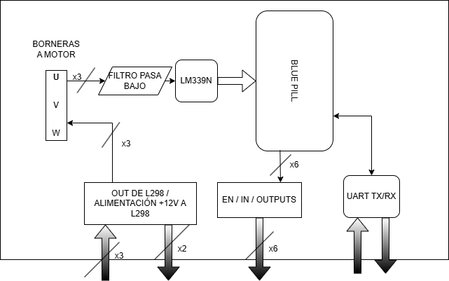
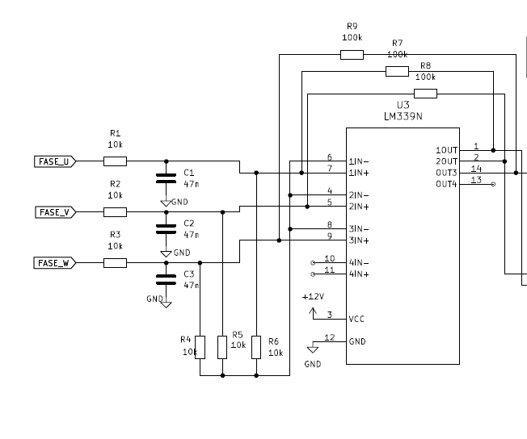

# ESC BLDC sensorless con STM32

Controlador electronico de velocidad (ESC) open-source y open-hardware para motores BLDC/PMSM sin sensores de posicion, basado en un microcontrolador STM32F103C8T6.

El proyecto implementa una estrategia sensorless por deteccion de cruces por cero de la BEMF, una etapa de arranque SPWM en lazo abierto y control de velocidad mediante PI. El prototipo fue validado con motores BLDC recuperados de discos rigidos y una etapa de potencia basada en modulos L298N.



## Informe

- Paper/informe en PDF: [INFORME/ESC_Bldc___paper_congreso_utn___en_revision.pdf](INFORME/ESC_Bldc___paper_congreso_utn___en_revision.pdf)
- Proyecto LaTeX/Overleaf: [INFORME/ESC_Bldc___paper_congreso_utn___en_revision/](INFORME/ESC_Bldc___paper_congreso_utn___en_revision/)
- Esquematicos auxiliares: [INFORME/esquematico_zc.pdf](INFORME/esquematico_zc.pdf) y [INFORME/esquematico_2zc.pdf](INFORME/esquematico_2zc.pdf)

## Vista general

El controlador esta orientado a aplicaciones de baja y media potencia donde el objetivo principal es regular velocidad, no posicion ni par instantaneo. La arquitectura combina:

- STM32F103C8T6 para temporizacion, PWM, captura de cruces por cero, UART y persistencia de parametros.
- Circuito externo con LM339 para deteccion de cruces por cero sobre la fase flotante.
- Conmutacion trapezoidal de seis pasos durante operacion sensorless.
- Arranque SPWM para llevar el motor a una zona donde la BEMF sea utilizable.
- Interfaz UART para comandos de configuracion y control.



## Hardware del prototipo

La maqueta separa la etapa logica y la etapa de potencia para facilitar pruebas, mediciones y cambios durante el desarrollo. En un producto final ambas etapas deberian integrarse en una placa dedicada con una etapa de potencia redisenada.



## Firmware

El firmware STM32 se encuentra en [firmware/](firmware/). Esta carpeta contiene el proyecto embebido, configuracion de perifericos, control del motor, maquina de estados, comunicacion UART y rutinas de arranque/control.

## Documentacion del codigo

- Indice general de documentacion: [docs/README.md](docs/README.md)
- Comandos de build y test: [docs/build-and-test.md](docs/build-and-test.md)
- CI/CD y releases: [docs/ci-cd.md](docs/ci-cd.md)
- Flujo SSD de features: [specs/README.md](specs/README.md)
- Ownership de protocolo compartido: [docs/architecture/protocol-ownership.md](docs/architecture/protocol-ownership.md)
- Flujo actual del firmware: [docs/PROJECT_FLOW.md](docs/PROJECT_FLOW.md)
- Configuracion Doxygen: [docs/Doxyfile](docs/Doxyfile)
- Salida HTML generada localmente: `docs/api/html/index.html`

## Estructura del repositorio

```text
.
|-- firmware/              Proyecto embebido STM32F103C8T6
|-- gui/EscGui/            GUI local Blazor, bridge, protocolo y tests
|-- .agents/               Convenciones neutrales para agentes
|-- docs/                  Documentacion del proyecto, build/test y CI/CD
|-- specs/                 Specs SSD versionadas por feature
|-- simulacion_agitador/   Soporte PIL/HIL/Simulink
|-- INFORME/               Paper, proyecto Overleaf, esquematicos e imagenes
|-- README.md              Resumen visual y tecnico del repositorio
```

`slprj/` y `out/` son salidas generadas localmente por Simulink, diagramas o herramientas auxiliares. No son raices fuente versionadas y estan ignoradas por Git.

## Resultados reportados

- Velocidad medida sin carga: hasta aproximadamente 5500 rpm.
- Velocidad minima observada: aproximadamente 100 rpm.
- Etapa de potencia del prototipo sin disipacion termica critica durante las pruebas reportadas.
- Principal limitacion: sensibilidad a desincronizacion ante cambios bruscos de velocidad o distorsion de los cruces por cero.

## Licencia

Este repositorio se publica bajo la licencia indicada en [LICENSE](LICENSE).
