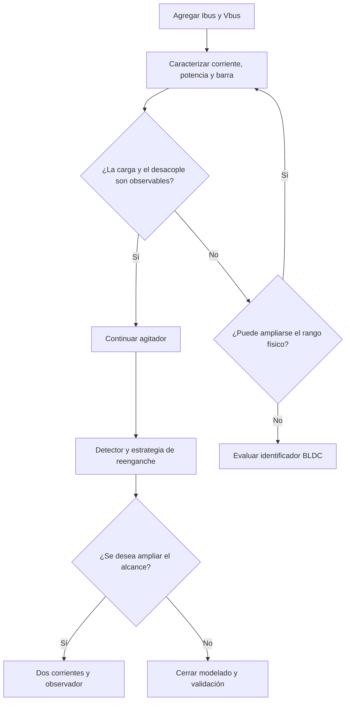

---
tags:
  - decisión
  - comparación
---

# Matriz de decisión

## Comparación cualitativa

| Alternativa | Alineación con anteproyecto | Reutilización | Profundidad potencial | Riesgo técnico | Tiempo a primer resultado |
|---|---|---|---|---|---|
| Validación sin nuevo sensado | Muy alta | Muy alta | Media | Bajo | Corto |
| Corriente y tensión de bus | Muy alta | Muy alta | Alta | Medio-bajo | Corto/medio |
| Dos corrientes + observador | Alta | Alta | Muy alta | Alto | Medio/largo |
| Tres shunts + FOC | Media | Media | Muy alta | Muy alto | Largo |
| Identificador de parámetros | Baja sin reformular | Media | Alta | Alto | Medio/largo |

## Recomendación

### Primera elección

**Corriente y tensión de bus**, porque:

- Produce datos útiles rápidamente.
- Sirve para el agitador aunque después no se implemente un observador.
- Permite decidir con evidencia si el proyecto tiene suficiente riqueza.
- No obliga a abandonar la BEMF ni el PI actual.
- Deja abierta una migración posterior a dos corrientes de fase.

### Segunda elección

**Dos corrientes y observador**, solo después de disponer de una medición estable y calibrada.

### No recomendado inicialmente

- Tres shunts y FOC.
- Migración inmediata al identificador BLDC.

Estas opciones son válidas, pero amplían el alcance antes de verificar si el problema actual ya ofrece suficiente contenido.

## Árbol de decisión

## Preguntas para revisar con el docente

1. ¿Considera suficiente el foco en estimación de carga y detección de desacople?
2. ¿Es obligatorio que la variable controlada sea la barra o puede validarse como indicador indirecto?
3. ¿Qué peso espera de la simulación frente al ensayo experimental?
4. ¿Acepta un sensor externo de barra utilizado solo como referencia de validación?
5. ¿Conviene presentar el observador de corriente como extensión opcional y no como requisito inicial?

