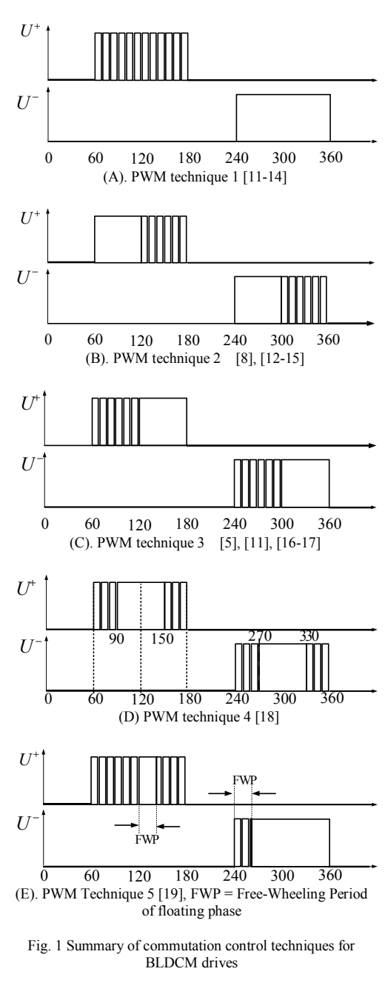
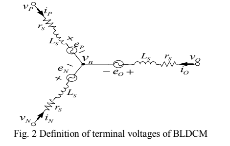
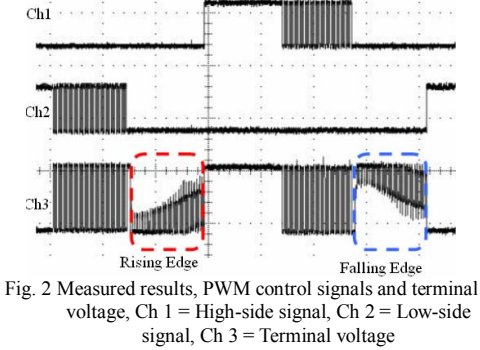
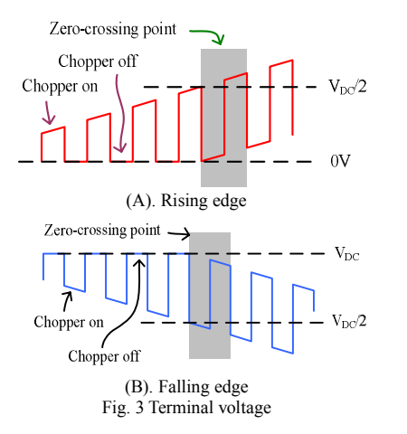
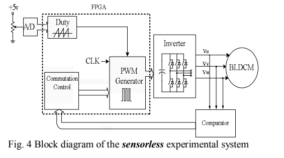
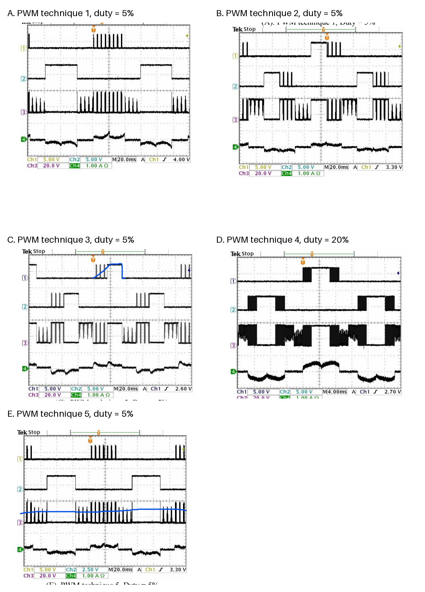
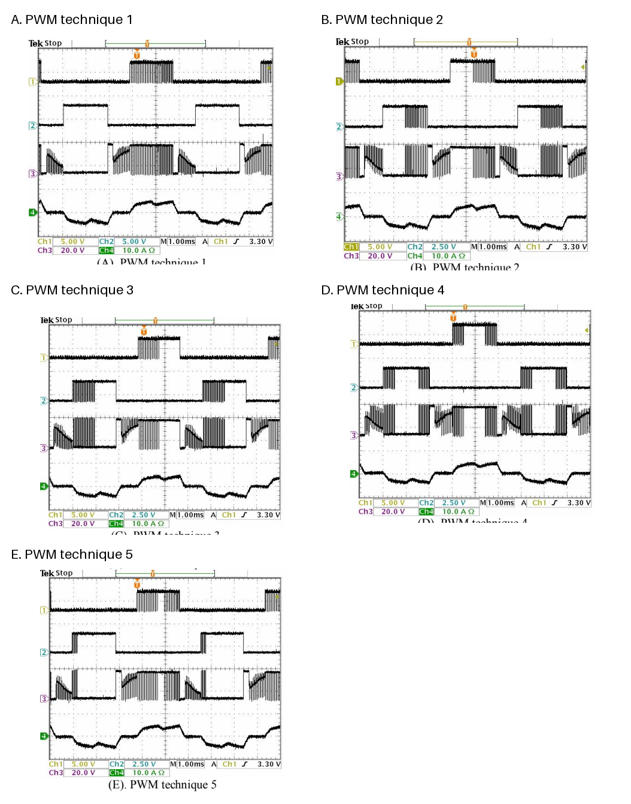

# A Unified Approach to Back-EMF Detection for Brushless DC Motor Drives without Current and Hall Sensors

**Authors:** Yen-Shin Lai and Young-Kai Lin  
**Affiliation:** Center for Power Electronics Technology, National Taipei University of Technology, 1, Sec. 3, Chung-Hsiao E. Rd., Taipei 106, Taiwan  
**Publication:** IEEE IECON 2006, pp. 1293-1298  
**Source:** [A Unified Approach to Back-EMF Detection for Brushless DC Motor.pdf](A%20Unified%20Approach%20to%20Back-EMF%20Detection%20for%20Brushless%20DC%20Motor.pdf)

> Conversion note: the original English text is preserved, equations are normalized to LaTeX, and tables are represented in native Markdown. Diagrams and oscilloscope captures are retained as images because they contain essential visual information. Any colored or handwritten marks visible in those images were already present in the source PDF.

## Abstract

The main theme of this paper is to present a unified approach to back-EMF detection of brushless DC motor drives without using any current and Hall sensors. Theoretical analysis of back-EMF detection is presented, followed by the relationship between PWM techniques and back-EMF detection. It will be shown that back-EMF detection depends upon the PWM techniques and that the method must be slightly modified as the PWM technique is changed. Experimental results derived from BLDCM drives without using any current and Hall sensors fully confirm the theoretical analysis.

**Keywords:** pulse-width modulation; brushless DC motor drives

## I. Introduction

Compared with a DC motor, a Brushless DC Motor (BLDCM) offers higher power density and does not require a mechanical commutation mechanism, resulting in a compact and robust structure. Compared with an induction motor, a BLDCM has no copper losses on the rotor side. Because of these features, the BLDCM has become more popular in applications where efficiency is critical or where spikes caused by mechanical commutation are not allowed. However, some technical issues in BLDCM control require attention. These include how to generate commutation signals without using expensive sensors.

For BLDCM drive control, zero-crossing-point detection of back electromotive force (back-EMF) is one of the most essential issues. Several approaches to zero-crossing detection of back-EMF have been proposed to achieve commutation control. These methods include position sensors such as Hall sensors [1], a current sensor [2], and a center-tap voltage with a resistor in series with the DC-link voltage source [3]. In [4], the BLDCM terminal voltages and a filter are used for zero-crossing detection. The filter removes the high-frequency switching noise caused by PWM control, but it introduces a time delay and thereby deteriorates torque-response performance.

In [5], the zero crossing of back-EMF is detected from the first nonzero current pulse after the freewheeling period of the floating phase. Several independent voltage sources for the detection circuit and suitable isolation mechanisms are required in this approach. Similar principles are applied to derive the zero-crossing point of back-EMF in [6]-[9].

These approaches are not suitable for very-high-speed operation. The approach in [10] solves this problem, but it is not suitable for low-speed or low-duty-ratio applications. To the authors' best knowledge, the relationship between PWM techniques and the back-EMF detection method had not yet been fully investigated.

This paper presents a unified back-EMF detection approach for various PWM techniques. It gives a theoretical analysis of back-EMF detection and then establishes its relationship with the PWM techniques. The back-EMF detection methods for low- and high-duty-ratio applications are also investigated. Experimental results obtained from BLDCM drives without current or Hall sensors confirm the theoretical analysis.

## II. PWM Techniques

The performance of BLDCM drives is determined by their commutation-control techniques. Figure 1 illustrates the PWM techniques used for commutation control, using one inverter leg as an example.

**Figure 1.** Summary of commutation-control techniques for BLDCM drives.

For **PWM technique 1**, the high-side power device is controlled by a chopper signal during every consecutive 120 electrical degrees of a fundamental period. The associated low-side control signal is shifted by 180 degrees relative to the high-side signal, clamping the related inverter output to the negative DC-link rail. The control signals for the other two legs are shifted by 120 and 240 degrees, respectively.

For **PWM technique 2**, the high-side power device is first turned on for one sixth of the fundamental period. During the following 60 degrees, the high-side device is controlled by the chopper signal. The same control signal, shifted by 180 degrees, is applied to the associated low-side power device.

For **PWM technique 3**, the high-side power device is chopped during one sixth of the fundamental period. During the following 60 degrees, it remains on and is clamped to the positive DC-link rail.

For **PWM technique 4**, the chopped region for the high-side power device is divided into two parts, each lasting 30 degrees. The same control signal, shifted by 180 degrees, is applied to the associated low-side power device.

**PWM technique 5** is basically the same as PWM technique 1. However, only during the freewheeling period of the floating phase is the high-side power device clamped to the positive DC-link rail while the low-side power device is PWM-controlled.

## III. Unified Back-EMF Detection Approach

Figure 2 defines the terminal voltages of the three-phase windings. The symbol $v_P$ denotes the terminal voltage of the phase connected to the positive DC-link rail during the PWM-control period. The symbol $v_N$ denotes the terminal voltage of the phase connected to the negative DC-link rail, and $v_O$ is the terminal voltage of the floating phase. "PWM control" means that the chopper signal is on; the duration of this interval is determined by the duty ratio. Back-EMF is detected through the terminal voltage of the floating phase.

**Figure 2.** Definition of the BLDCM terminal voltages.

Because back-EMF is detected from the floating-phase terminal voltage,

$$
i_P=-i_N, \qquad i_O=0.
\tag{1}
$$

By Kirchhoff's voltage law applied to Figure 2,

$$
\begin{aligned}
v_n
&=v_P-\left(i_P r_S+L_S\frac{di_P}{dt}\right)-e_P \\
&=v_N+\left(i_P r_S+L_S\frac{di_P}{dt}\right)-e_N.
\end{aligned}
\tag{2}
$$

The center-tap voltage is therefore

$$
v_n=\frac{v_P+v_N}{2}-\frac{e_P+e_N}{2}.
\tag{3}
$$

The floating-phase terminal voltage is

$$
\begin{aligned}
v_O
&=v_n+e_O \\
&=\frac{v_P+v_N}{2}-\frac{e_P+e_N}{2}+e_O.
\end{aligned}
\tag{4}
$$

Since

$$
e_P+e_N=0,
\tag{5}
$$

Equation (4) can be rewritten as

$$
v_O=\frac{v_P+v_N}{2}+e_O.
\tag{6}
$$

Thus, during the PWM-control period, the floating-phase terminal voltage depends on the voltages applied to the phases connected to the positive and negative DC-link rails.

The following measured waveforms use PWM technique 2 as an example. The floating-phase terminal voltage has either a rising or falling edge; in both cases the back-EMF zero crossing is reflected at a particular terminal-voltage reference.

**Figure 2 (as numbered in the source).** Measured results: CH1 is the high-side signal, CH2 the low-side signal, and CH3 the terminal voltage.

For the rising edge in Figure 3(A), the floating-phase terminal voltage is analyzed during the chopper-on and chopper-off intervals. During the chopper-on interval of PWM technique 2, the positive phase is connected to the positive DC-link rail and the negative phase is connected to the negative DC-link rail. From (6),

$$
v_O=\frac{V_{DC}}{2}+e_O.
\tag{7}
$$

The zero-crossing detection condition is therefore

$$
v_O=\frac{V_{DC}}{2}.
\tag{8}
$$

During the chopper-off interval of PWM technique 2, both the positive and negative phases are connected to the negative DC-link rail. Consequently,

$$
v_O=e_O.
\tag{9}
$$

For the falling edge in Figure 3(B), the positive phase is again connected to the positive DC-link rail and the negative phase to the negative DC-link rail during the chopper-on interval. Thus,

$$
v_O=\frac{V_{DC}}{2}+e_O,
\tag{10}
$$

and the zero-crossing detection condition is

$$
v_O=\frac{V_{DC}}{2}.
\tag{11}
$$

During the chopper-off interval, both phases are connected to the positive DC-link rail, giving

$$
v_O=V_{DC}+e_O.
\tag{12}
$$

The floating-phase terminal voltage is therefore $V_{DC}$ when the back-EMF zero crossing occurs in this case.

**Figure 3.** Floating-phase terminal voltage for rising and falling edges.

The three possible voltage combinations for zero-crossing-point (ZCP) detection are summarized below. They are determined by both the PWM technique and whether the chopper is on or off.

**Table 1. Back-EMF zero-crossing-point detection conditions**

| Quantity | Case 1 | Case 2 | Case 3 |
|---|---:|---:|---:|
| Positive-side voltage $v_P$ | $V_{DC}$ | $V_{DC}$ | $0$ |
| Negative-side voltage $v_N$ | $V_{DC}$ | $0$ | $0$ |
| Open-phase voltage $v_O$ | $V_{DC}+e_O$ | $V_{DC}/2+e_O$ | $e_O$ |
| ZCP-detection condition | $v_O=V_{DC}$ | $v_O=V_{DC}/2$ | $v_O=0$ |
| Detection interval | Chopper off | Chopper on | Chopper off |

When $0$ V is used as the reference, the allowable back-EMF detection interval is $(1-D)T_S$, where $D$ is duty ratio and $T_S$ is the sampling period. This interval becomes significantly shorter at very high duty ratios. In contrast, using $0.5V_{DC}$ as the reference works well only over a certain duty-ratio range and does not work at very low duty ratios. To cover both high- and low-duty-ratio regions, the back-EMF zero crossings must be considered during chopper-on and chopper-off intervals, respectively.

Similar conditions and detection instants can be derived for the other PWM techniques. Table 2 shows that the correct back-EMF detection method depends on the PWM technique. Full-duty-range detection requires sensing the terminal voltage during the appropriate chopper-on or chopper-off interval.

**Table 2. Back-EMF detection method for each PWM technique**

| PWM technique | Duty region and edge | Reference and sampling interval |
|---|---|---|
| PWM 1 | Rising and falling, $D\ge 50\%$ | $v_O=V_{DC}/2$, chopper on |
| PWM 1 | Rising and falling, $D<50\%$ | $v_O=0$, chopper off |
| PWM 2 | Rising and falling, $D\ge 50\%$ | $v_O=V_{DC}/2$, chopper on |
| PWM 2 | Rising, $D<50\%$ | $v_O=0$, chopper off |
| PWM 2 | Falling, $D<50\%$ | $v_O=V_{DC}$, chopper off |
| PWM 3 | Rising and falling, $D\ge 50\%$ | $v_O=V_{DC}/2$, chopper on |
| PWM 3 | Rising, $D<50\%$ | $v_O=V_{DC}$, chopper off |
| PWM 3 | Falling, $D<50\%$ | $v_O=0$, chopper off |
| PWM 4 | Rising and falling | $v_O=V_{DC}/2$, chopper on |
| PWM 5 | Rising and falling, $D\ge 50\%$ | $v_O=V_{DC}/2$, chopper on |
| PWM 5 | Rising and falling, $D<50\%$ | $v_O=0$, chopper off |

## IV. Experimental Confirmation

The experimental system uses an FPGA controller to implement sensorless control, including back-EMF zero-crossing detection, PWM control, and duty-ratio control.

**Table 3. FPGA features**

| Parameter | Value |
|---|---|
| Part number | EPF10K70RC240-3 |
| Typical gates | 70000 |
| Logic elements | 3744 |
| I/O pin count | 189 |
| Supply voltage | 5 V |

The experimental system consists of the FPGA controller, an inverter, the BLDCM specified in the appendix, and a back-EMF detection circuit. The algorithm requires neither a current sensor nor Hall sensors.

**Figure 4.** Block diagram of the sensorless experimental system.

Figures 5 and 6 show the high-side and low-side control signals, phase voltage, and phase current at low and high duty ratios, respectively. For PWM technique 4, back-EMF can only be detected while the chopper is on; low-duty operation is therefore limited. By contrast, the other PWM techniques can operate at a duty ratio of 5% because back-EMF can be detected while the chopper is off.

**Figure 5.** Experimental results at low duty ratio: CH1 is high-side control, CH2 low-side control, CH3 phase voltage, and CH4 phase current. PWM techniques 1, 2, 3, and 5 use $D=5\%$; PWM technique 4 uses $D=20\%$.

**Figure 6.** Experimental results at $D=90\%$: CH1 is high-side control, CH2 low-side control, CH3 phase voltage, and CH4 phase current.

The back-EMF waveform changes when the PWM technique changes. Nevertheless, the presented algorithm detects the back-EMF zero crossing at both high and low duty ratios. The experimental results confirm the analysis.

## V. Conclusions

This paper presents a unified back-EMF detection method for PWM-controlled brushless DC motor drives. The theoretical analysis shows that the back-EMF detection method must be slightly modified when the PWM control method changes. Experimental results from BLDCM drives without current or Hall sensors confirm the theoretical analysis.

## Appendix: Motor Specifications

| Parameter | Value |
|---|---:|
| Number of poles | 8 |
| Rated power | 70 W |
| DC-link voltage $V_{DC}$ | 24 V |
| Rated speed | 2500 rpm |

## References

1. J. P. M. Bahlmann, "A full-wave motor drive IC based on the back-EMF sensing principle," *IEEE Transactions on Consumer Electronics*, vol. 35, no. 3, pp. 415-420, 1989.
2. T. Nagate, A. Uetake, Y. Koike, and K. Tabata (Seiko Epson Co.), "Brushless DC motor without position sensors and its," European Patent EP0553354-A1-19930804, 1993.
3. K. Nishimura (Rohm Co. Ltd.), "Sensorless motor drives," U.S. Patent 6,111,372, 2000.
4. G. J. Su and J. W. McKeever, "Low cost sensorless control of brushless DC motors with improved speed range," *Proceedings of the Applied Power Electronics Conference and Exposition*, pp. 286-292, 2002.
5. S. Ogasawara and H. Akagi, "An approach to position sensorless drive for brushless DC motors," *IEEE Transactions on Industrial Applications*, vol. 27, no. 3, pp. 928-933, 1991.
6. J. Shao, D. Nolan, and T. Hopkins, "A novel direct back-EMF detection for sensorless brushless DC (BLDC) motor drives," *Proceedings of IEEE APEC*, pp. 33-37, 2002.
7. SGS-Thomson Microelectronics (assignee), "Control of a Brushless Motor," U.S. Patent 5,859,520, 1999.
8. J. Shao, D. Nolan, M. Teissier, and D. Swanson, "A novel microcontroller-based sensorless brushless DC (BLDC) motor drive for automotive fuel pumps," *IEEE Transactions on Industry Applications*, vol. 39, pp. 1734-1740, Dec. 2003.
9. J. Shao, D. Nolan, and T. Hopkins, "Improved direct back-EMF detection for sensorless brushless DC (BLDC) motor drives," *Proceedings of IEEE APEC*, pp. 300-305, 2003.
10. Y. S. Lai, F. S. Shyu, and Y. S. Chang, "Novel sensorless PWM-controlled BLDCM drives without using position and current sensors, filter and center-tap voltage," *Proceedings of IEEE IECON*, pp. 2144-2149, 2003.
11. Seiko Epson Corp., "Brushless DC motor without position sensor and its controller," European Patent 0 553 354 B1, 1993.
12. Tokyo Shibaura Electric Co., "Inverter and air conditioner controlled by the same," U.S. Patent 5,486,743, 1996.
13. ST Microelectronics, "Control of a brushless motor," U.S. Patent 5,859,520, 1999.
14. G. J. Su and J. W. McKeever, "Low-cost sensorless control of brushless DC motors with improved speed range," *IEEE Transactions on Industrial Applications*, vol. 19, pp. 296-303, March 2003.
15. R. C. Becerra, T. M. Jahns, and M. Ehsani, "Four-quadrant sensorless brushless ECM drive," *Applied Power Electronics Conference and Exposition, Sixth Annual*, pp. 202-209, March 1991.
16. Y. S. Lai, F. S. Shyu, and Y. H. Chang, "Novel loss reduction pulse-width modulation technique for brushless DC motor drives fed by MOSFET inverter," *IEEE Transactions on Power Electronics*, vol. 19, pp. 1646-1656, 2004.
17. Y. S. Lai, F. S. Shyu, and Y. H. Chang, "Novel pulse-width modulation technique with loss reduction for small power brushless DC motor drives," *Conference Record, IEEE IAS Annual Meeting*, pp. 2057-2064, 2002.
18. Tokyo Shibaura Electric Co., "Drive control apparatus for brushless DC motor and driving method therefore," U.S. Patent 5,491,393, 1996.
19. Y. S. Lai, F. S. Shyu, and Y. K. Lin, "Novel PWM technique without causing reversal DC-link current for brushless DC motor drives with bootstrap driver," *Conference Record, IEEE IAS Annual Meeting*, pp. 2182-2188, 2005.
20. [Altera](http://www.altera.com).
