# 2.A. Etapas esenciales de un sistema DSP

**Autor:** Dr. Ing. Hernán Garrido  
**Asignatura:** Control y Sistemas - Universidad Nacional de Cuyo, Facultad de Ingeniería  
**Contacto:** carloshernangarrido@gmail.com  
**Fecha:** noviembre de 2023  
**Fuente:** [dsp.pdf](dsp.pdf)

> Nota de conversión: las diapositivas repetidas de contenidos se consolidaron en un único índice. Las fórmulas se normalizaron a LaTeX y los diagramas se conservaron como imágenes para mantener su información visual.

## Contenidos

1. Introducción
2. Filtro antialiasing
3. Técnica de oversampling
4. Conversión A/D
5. Error de cuantización
6. Relación señal-ruido de un conversor A/D y su relación con la cantidad de bits
7. Conversión D/A
8. Técnicas de upsampling, pre-ecualización y post-ecualización

## 1. Introducción

### DSP en el contexto de los sistemas de control

En un sistema de control digital, el proceso físico contiene actuadores, el sistema y los sensores. Puede recibir perturbaciones externas y ruido tanto a la entrada como a la salida.

El controlador recibe la salida medida a través de un filtro y un conversor A/D. La computadora procesa la señal digital y envía la acción de control al proceso mediante un conversor D/A. Un reloj sincroniza la computadora y los conversores, mientras que el operador proporciona las consignas.

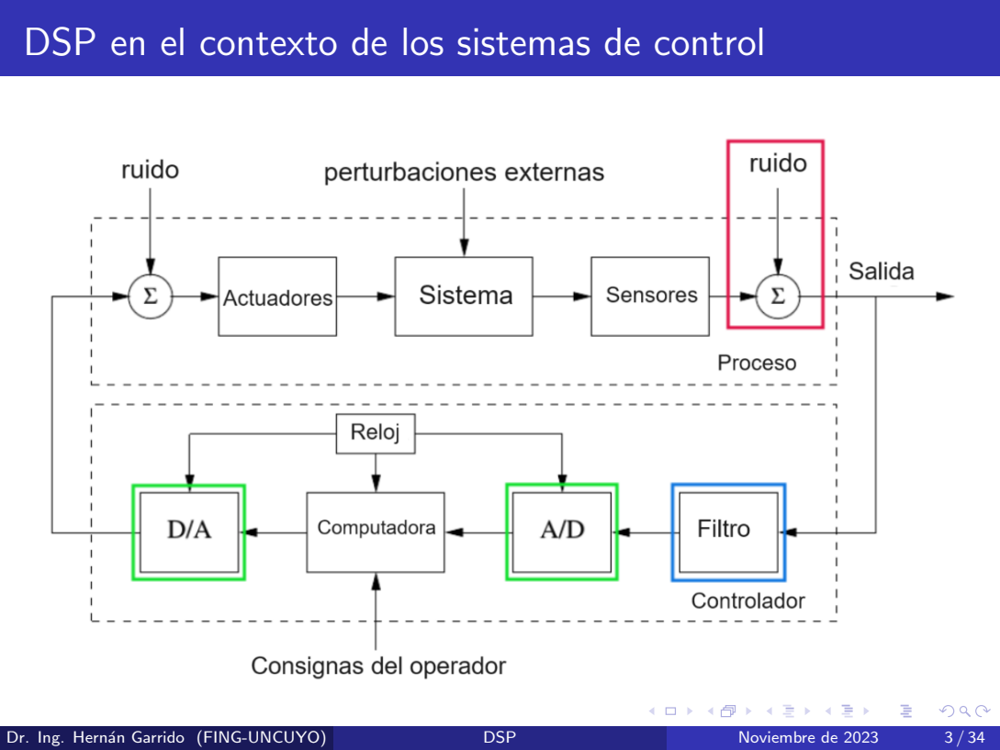

### Etapas de un sistema de procesamiento de señales

La representación simplificada es:

$$
x_c(t) \xrightarrow{C/D} x[n]
\xrightarrow{\text{sistema en tiempo discreto}} y[n]
\xrightarrow{D/C} y_r(t)
$$

En una implementación completa, la cadena es:

1. Filtro antialiasing analógico $H_{aa}(j\Omega)$.
2. Muestreo y retención.
3. Conversión A/D.
4. Procesamiento en tiempo discreto.
5. Conversión D/A.
6. Filtro de reconstrucción compensado $\widetilde{H}_r(j\Omega)$.

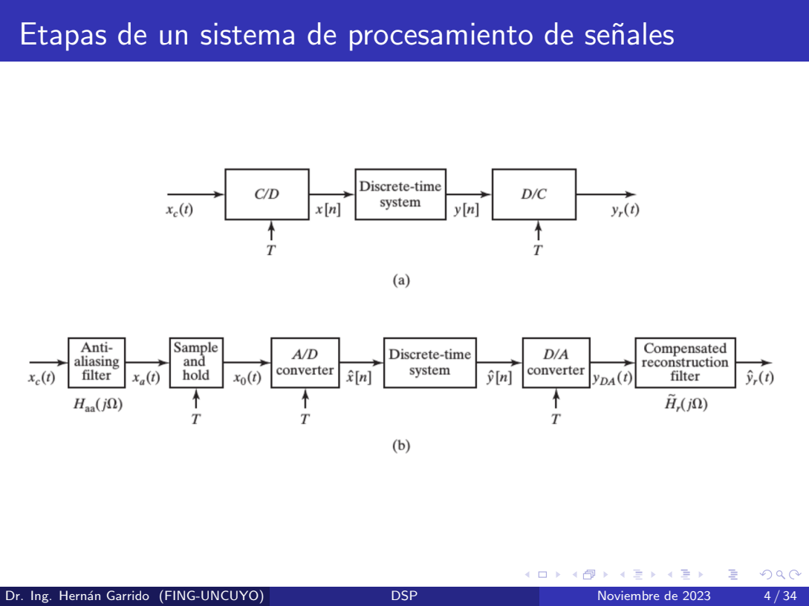

### Muestreo periódico

Si una señal en tiempo continuo $x_c(t)$ se muestrea periódicamente, se obtiene una señal en tiempo discreto:

$$
x[n] = x_c(nT)
$$

donde:

- $T$ es el período de muestreo;
- $n \in \mathbb{Z}$;
- $f_s = 1/T$ es la tasa de muestreo;
- $\Omega_s = 2\pi f_s$ es la tasa de muestreo en radianes.

### Proceso de muestreo

El muestreo se puede interpretar como dos operaciones:

1. Multiplicación por un tren de impulsos unitarios.
2. Conversión de una función discontinua en $t$ a una sucesión en $n$.

El diagrama compara el muestreo de una misma señal con $T=T_1$ y con $T=2T_1$, y muestra las sucesiones resultantes.

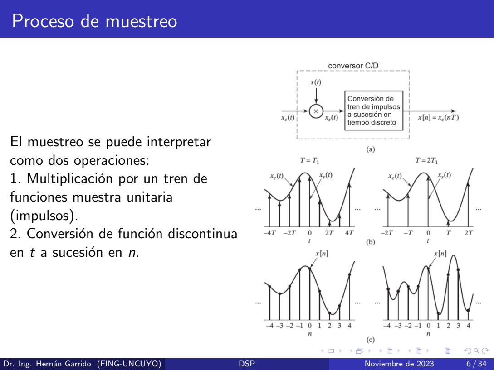

### Teorema del muestreo de Nyquist-Shannon

Sea $x_c(t)$ una señal de banda limitada tal que:

$$
X_c(j\Omega) = 0, \qquad \forall\, |\Omega| \geq \Omega_N
$$

Entonces $x_c(t)$ queda determinada por sus muestras $x[n]=x_c(nT)$, con $n\in\mathbb{Z}$, si:

$$
\Omega_s = \frac{2\pi}{T} \geq 2\Omega_N
$$

A $\Omega_N$ se la llama frecuencia de Nyquist y a $2\Omega_N$, tasa de Nyquist. Esta última es la mínima tasa a la que debe muestrearse $x_c(t)$ para que luego pueda ser reconstruida.

### Teorema del muestreo en el dominio de la frecuencia

Al multiplicar la señal continua $x_c(t)$ por el tren periódico de impulsos $s(t)$ se obtiene la señal muestreada $x_s(t)$:

$$
x_s(t)=x_c(t)s(t)
=x_c(t)\sum_{n=-\infty}^{\infty}\delta(t-nT)
=\sum_{n=-\infty}^{\infty}x_c(nT)\delta(t-nT)
$$

La transformada de Fourier de la señal continua es $X_c(j\Omega)$. Para el tren de impulsos:

$$
S(j\Omega)=\frac{2\pi}{T}\sum_{k=-\infty}^{\infty}
\delta(\Omega-k\Omega_s),
\qquad \Omega_s=\frac{2\pi}{T}
$$

Por lo tanto, la transformada de la señal muestreada es:

$$
X_s(j\Omega)
=\frac{1}{2\pi}X_c(j\Omega)*S(j\Omega)
=\frac{1}{T}\sum_{k=-\infty}^{\infty}
X_c\!\left(j(\Omega-k\Omega_s)\right)
$$

### Aliasing

- $X_s(j\Omega)$ contiene copias periódicas de $X_c(j\Omega)$.
- Las copias están separadas por $\Omega_s$.
- El solapamiento comienza cuando $\Omega_s-\Omega_N=\Omega_N$.
- Si $\Omega_s\geq 2\Omega_N$, se evita el solapamiento de las copias.

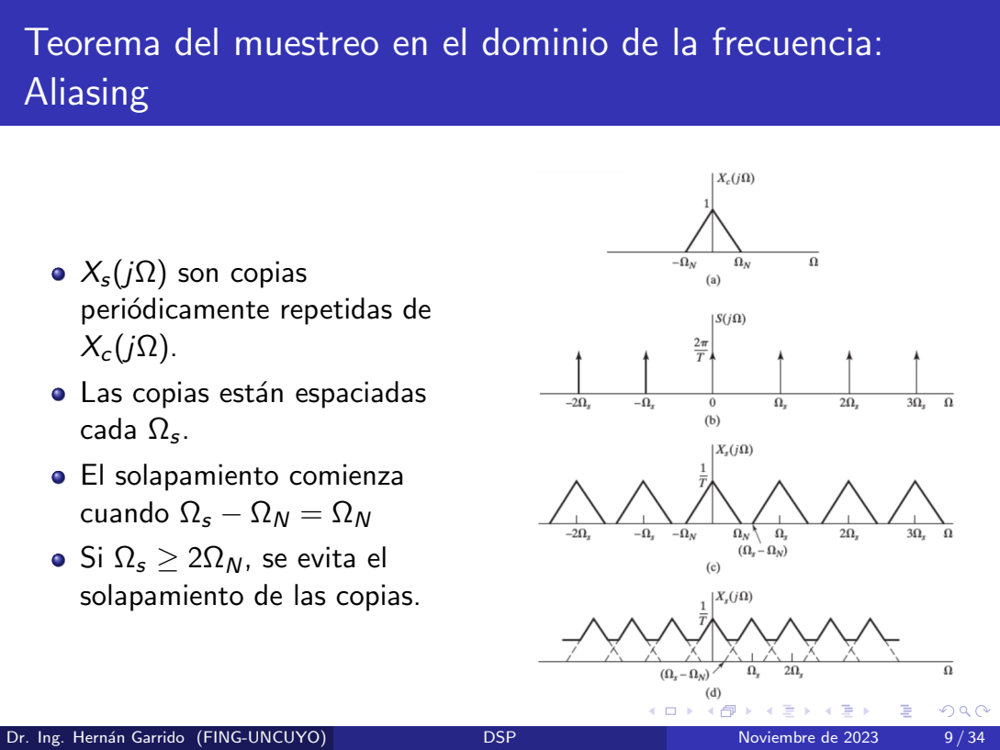

## 2. Filtro antialiasing

### Necesidad

Para evitar el solapamiento o aliasing hay dos caminos:

- aumentar $\Omega_s$;
- limitar $\Omega_N$.

Aunque se aumente mucho $\Omega_s$, puede no ser posible evitar el aliasing si $\Omega_N$ no está limitada. Esto puede ocurrir incluso con señales naturalmente limitadas en banda, como la música, debido al ruido de banda ancha presente en toda medición analógica.

La cadena completa emplea un filtro antialiasing antes del ADC y un filtro de reconstrucción después del DAC.

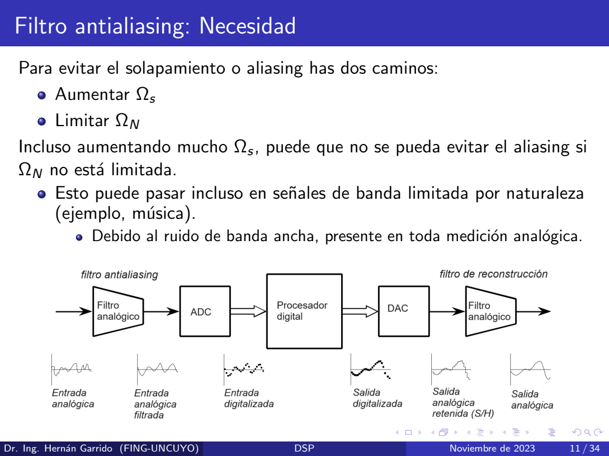

### Implementación: filtro Sallen-Key

Un circuito Sallen-Key modificado puede utilizarse como bloque de construcción de filtros activos. Cada etapa implementa un filtro pasa-bajos de dos polos; los filtros de orden superior se obtienen conectando varias etapas en cascada.

Una vez elegidos $R_1$ y $C$ - por ejemplo, $10\,\text{k}\Omega$ y $0.01\,\mu\text{F}$ - se calculan:

$$
R=\frac{k_1}{C f_c},
\qquad
R_f=R_1 k_2
$$

donde $f_c$ es la frecuencia de corte en hertz.

| Polos | Etapa | Bessel $k_1$ | Bessel $k_2$ | Butterworth $k_1$ | Butterworth $k_2$ | Chebyshev (6 % ripple) $k_1$ | Chebyshev (6 % ripple) $k_2$ |
|---:|---:|---:|---:|---:|---:|---:|---:|
| 2 | 1 | 0.1251 | 0.268 | 0.1592 | 0.586 | 0.1293 | 0.842 |
| 4 | 1 | 0.1111 | 0.084 | 0.1592 | 0.152 | 0.2666 | 0.582 |
| 4 | 2 | 0.0991 | 0.759 | 0.1592 | 1.235 | 0.1544 | 1.660 |
| 6 | 1 | 0.0990 | 0.040 | 0.1592 | 0.068 | 0.4019 | 0.537 |
| 6 | 2 | 0.0941 | 0.364 | 0.1592 | 0.586 | 0.2072 | 1.448 |
| 6 | 3 | 0.0834 | 1.023 | 0.1592 | 1.483 | 0.1574 | 1.846 |
| 8 | 1 | 0.0894 | 0.024 | 0.1592 | 0.038 | 0.5359 | 0.522 |
| 8 | 2 | 0.0867 | 0.213 | 0.1592 | 0.337 | 0.2657 | 1.379 |
| 8 | 3 | 0.0814 | 0.593 | 0.1592 | 0.889 | 0.1848 | 1.711 |
| 8 | 4 | 0.0726 | 1.184 | 0.1592 | 1.610 | 0.1582 | 1.913 |

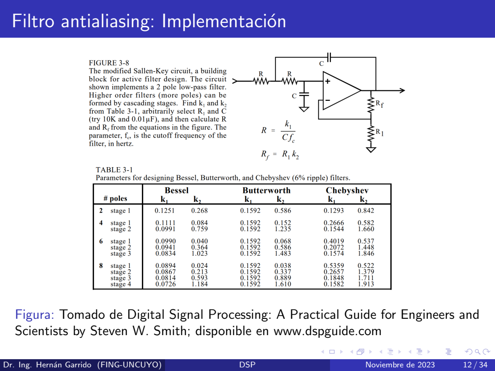

Fuente de la figura y la tabla: Steven W. Smith, *The Scientist and Engineer's Guide to Digital Signal Processing*, disponible en [dspguide.com](https://www.dspguide.com/).

### Limitaciones de la implementación analógica

Todo filtro tiene una banda de transición, la cual debe:

- comenzar después de $\Omega_N$, para no perder señal útil;
- terminar antes de $\Omega_s-\Omega_N$, para evitar el solapamiento.

En los filtros analógicos es difícil lograr una banda de transición muy estrecha. Las respuestas Bessel, Butterworth y Chebyshev muestran distintos compromisos y mejoran su selectividad a medida que aumenta la cantidad de polos.

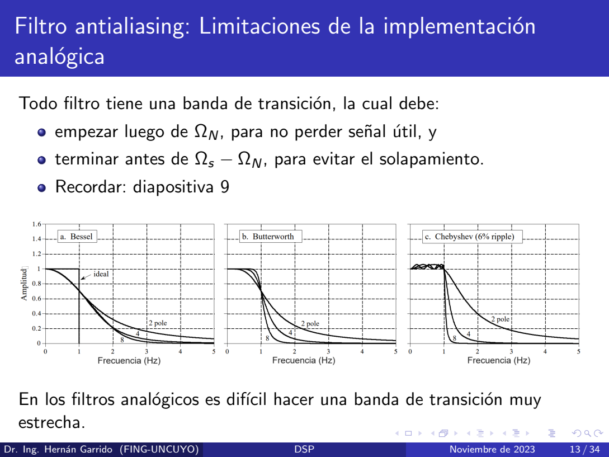

## 3. Técnica de oversampling

### Diagrama en bloques

La técnica emplea la siguiente cadena:

1. Un filtro antialiasing analógico simple.
2. Un conversor C/D que muestrea con período

   $$
   T=\frac{1}{M}\left(\frac{\pi}{\Omega_N}\right)
   =\frac{\pi}{M\Omega_N}.
   $$

3. Un filtro antialiasing digital abrupto con frecuencia de corte $\pi/M$.
4. Una reducción de la tasa de muestreo por un factor $M$.

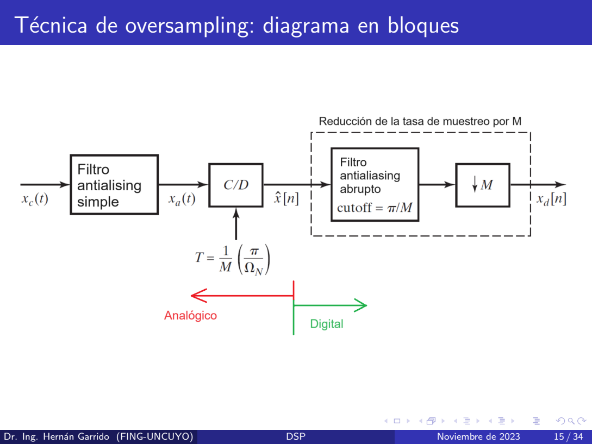

### Análisis en frecuencia

El filtro analógico simple conserva la señal útil en $[-\Omega_N,\Omega_N]$ y atenúa parte del ruido de alta frecuencia. Se muestrea con una tasa mayor que la de Nyquist, típicamente $\Omega_s=2M\Omega_N$, para separar las réplicas del espectro y dejar espacio a una transición analógica más amplia.

En frecuencia digital:

$$
\omega=\Omega T,
\qquad
\omega_N=\Omega_NT=\frac{\pi}{M}
$$

El filtro digital elimina el ruido que quedaría solapado al decimar. Después se toma una de cada $M$ muestras:

$$
T_d=MT,
\qquad
\omega=\Omega T_d
$$

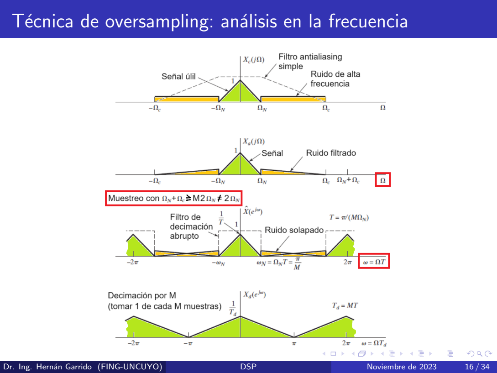

## 4. Conversión A/D

Un conversor analógico a digital (A/D) es un dispositivo físico, discreto o integrado en un microcontrolador, que:

- recibe una señal analógica de tensión constante;
- la convierte en un código binario que representa un valor cuantizado.

Para trabajar con señales analógicas variables se agrega una etapa de muestreo y retención antes del conversor A/D, normalmente un retenedor de orden cero (*zero-order hold*).

La implementación puede descomponerse en muestreo C/D, cuantizador y codificador.

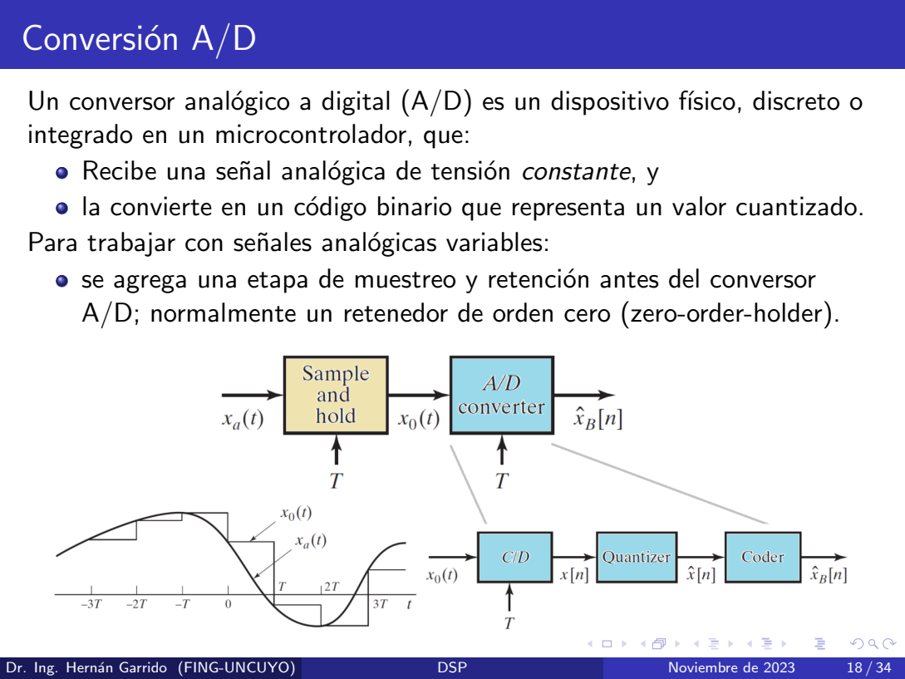

## 5. Error de cuantización

### Cuantizador

Un cuantizador es un sistema no lineal cuyo objetivo es transformar la muestra de entrada $x[n]\in\mathbb{R}$ en una salida:

$$
\hat{x}[n]\in\{v_1,v_2,\ldots,v_n\}
$$

donde $v_1,v_2,\ldots,v_n$ son valores prescritos.

La cantidad de valores prescritos y la precisión del cuantizador son:

$$
n=2^{B+1}
$$

$$
\Delta
=\frac{V_{\max}-V_{\min}}{2^{B+1}}
=\frac{2X_m}{2^{B+1}}
=\frac{X_m}{2^B}
$$

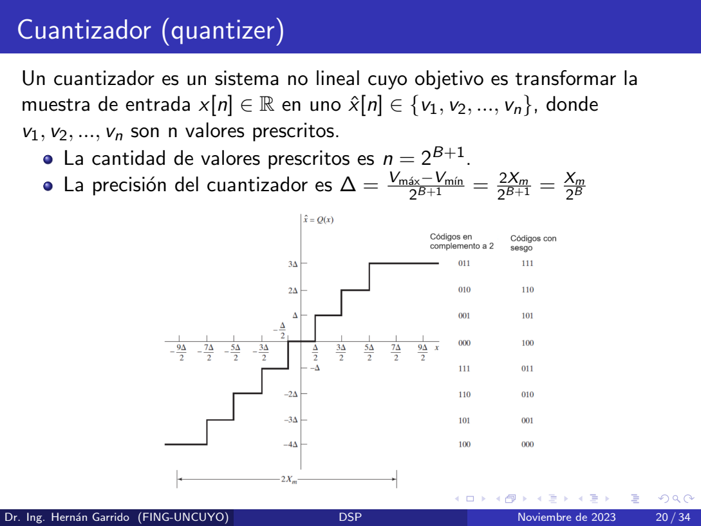

### Modelo aditivo del error

El error de cuantización se puede representar con un modelo aditivo:

$$
\hat{x}[n]=Q(x[n])=x[n]+e[n]
$$

La figura compara una señal original, su versión cuantizada con 3 bits y los errores de cuantización obtenidos con 3 y 8 bits. Al aumentar la cantidad de bits, disminuye la amplitud del error.

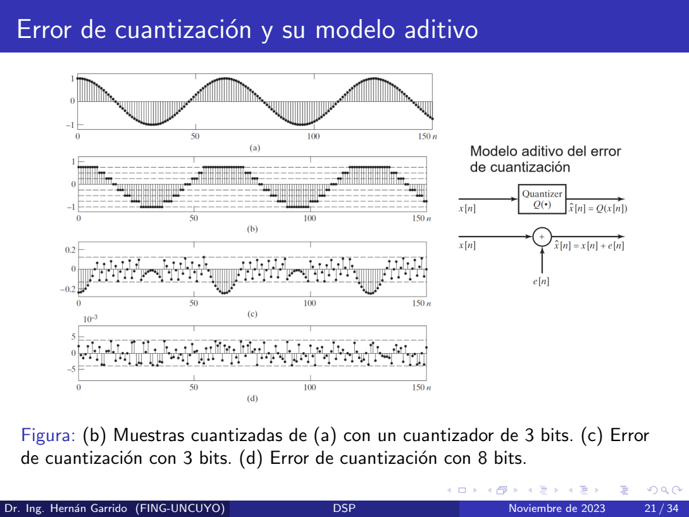

## 6. Relación señal-ruido y cantidad de bits

### Relación señal-ruido de un conversor A/D

Si $\Delta$ es pequeño, se puede asumir que el error de cuantización está uniformemente distribuido. Su densidad de probabilidad es constante, $p_e(e)=1/\Delta$, dentro de $[-\Delta/2,\Delta/2]$ y nula fuera de ese intervalo.

Su varianza es:

$$
\sigma_e^2
=\int_{-\Delta/2}^{\Delta/2}\frac{1}{\Delta}e^2\,de
=\frac{\Delta^2}{12}
$$

Si $x[n]$ es una señal pura, la relación señal-ruido de $\hat{x}[n]$ resulta:

$$
\operatorname{SNR}_{ADC}
=10\log_{10}\left(\frac{\sigma_x^2}{\sigma_e^2}\right)
=6.02B-20\log_{10}\left(\frac{X_m}{\sigma_x}\right)+10.8
$$

Para un seno de excursión completa, $X_m/\sigma_x=\sqrt{2}$. Con 8 bits en total, expresados en la diapositiva como $B=7$, se obtiene aproximadamente $50\,\text{dB}$.

### Selección de la cantidad de bits

Considérese una señal analógica ya muestreada pero aún no cuantizada, $x[n]$, con relación señal-ruido $\operatorname{SNR}_{x[n]}$.

Si $\operatorname{SNR}_{ADC}\geq\operatorname{SNR}_{x[n]}$, la señal cuantizada $\hat{x}[n]$ tendrá la misma relación señal-ruido que $x[n]$. Los $B_{\text{noise}}$ bits menos significativos representarán ruido de la señal original, donde:

$$
B_{\text{noise}}
\approx\frac{\operatorname{SNR}_{ADC}-\operatorname{SNR}_{x[n]}}{6}
=\frac{20\log_{10}\!\left(\frac{\text{ruido en }x[n]}{\text{ruido del ADC}}\right)}{6}
$$

Si $\operatorname{SNR}_{ADC}<\operatorname{SNR}_{x[n]}$, la señal cuantizada tendrá una relación señal-ruido peor que la original.

En la práctica:

$$
B_{\text{noise}}\geq 1
$$

Si $B_{\text{noise}}\gg 1$, pueden descartarse algunos bits antes de almacenar el dato en memoria u operar con él.

## 7. Conversión D/A

Un conversor digital a analógico (D/A) es un dispositivo físico, discreto o integrado en un microcontrolador, que:

- recibe un código binario que representa un valor cuantizado;
- lo convierte en una señal analógica de tensión constante.

Sus dos parámetros principales son:

- **Resolución:** número de valores distintos que puede entregar a la salida. Normalmente es $2^{B+1}$, donde $B+1$ es la cantidad de bits del conversor. La diapositiva original dice "bits del ADC", aunque por el contexto se refiere al DAC.
- **Tasa de muestreo máxima:** máximo número de muestras por unidad de tiempo que el conversor puede entregar correctamente a la salida.

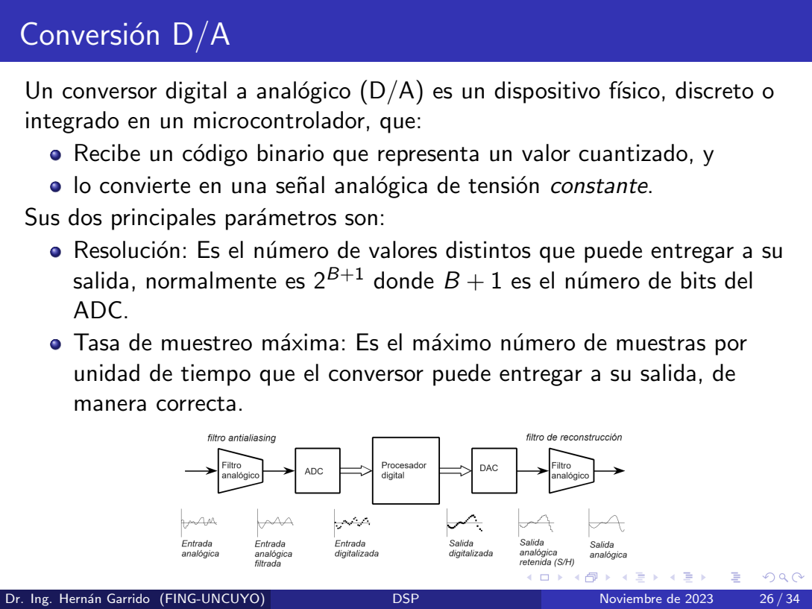

### Conversión D/A en el tiempo y en la frecuencia

Un retenedor de orden cero convierte el tren de impulsos en una señal escalonada. En el dominio de la frecuencia, el espectro periódico del tren de impulsos queda multiplicado por una envolvente sinc, lo que atenúa las componentes de frecuencia más alta.

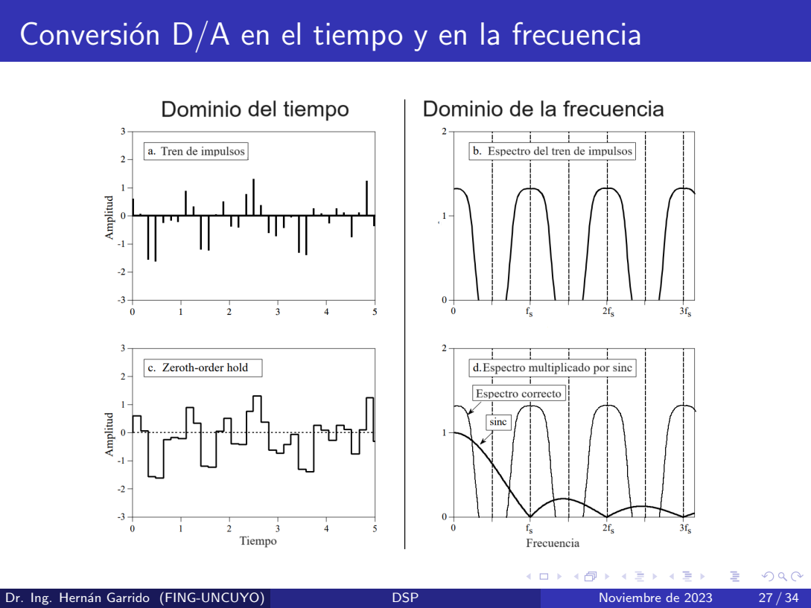

La magnitud de la respuesta del retenedor se expresa como:

$$
H(f)=\left|\frac{\sin(\pi f/f_s)}{\pi f/f_s}\right|
$$

Un filtro de reconstrucción elimina las imágenes espectrales y compensa la atenuación en la banda útil para recuperar la señal analógica.

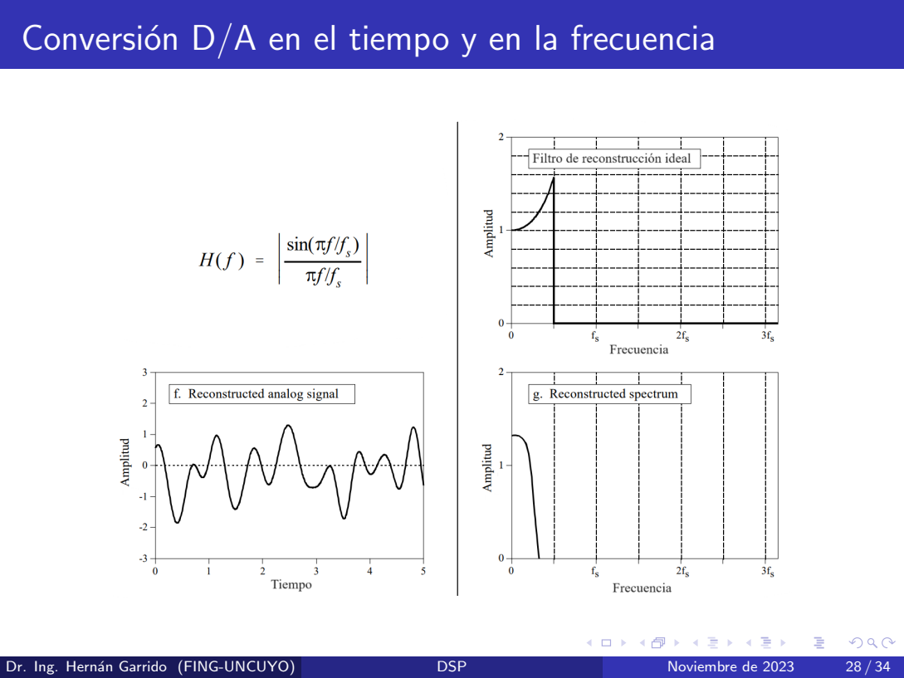

## 8. Upsampling, pre-ecualización y post-ecualización

Existen cuatro formas de implementar la reconstrucción:

1. **No realizarla:** aceptar las consecuencias de la distorsión y las imágenes espectrales.
2. **Post-ecualización:** utilizar un filtro analógico cuya respuesta en frecuencia elimine las altas frecuencias y, además, refuerce las frecuencias altas de la banda útil que fueron atenuadas por el retenedor de orden cero (ZOH).
3. **Pre-ecualización:** utilizar un filtro digital que refuerce las frecuencias altas de la banda útil antes de ingresar la señal al conversor D/A.
4. **Upsampling:**
   - interpolar rellenando con ceros, operación inversa a la decimación;
   - aplicar opcionalmente un filtro pasa-bajos digital;
   - convertir la señal a analógico;
   - utilizar finalmente un filtro analógico de reconstrucción simple.

### Ejemplo de upsampling

El ejemplo parte de una señal continua $x_c(t)$ y de su espectro $X_c(j\Omega)$.

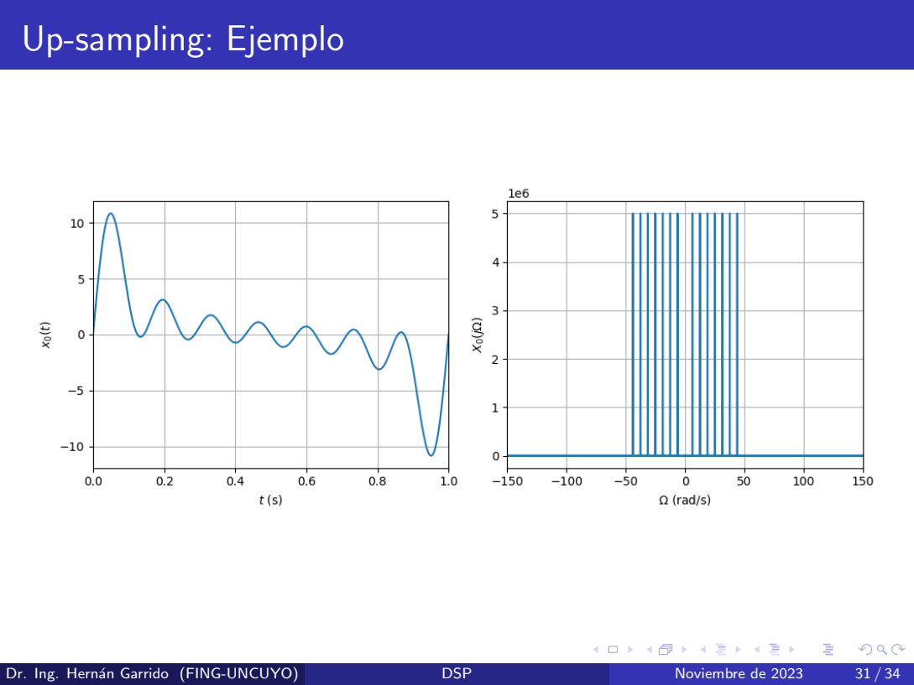

Al interpolar únicamente con ceros, se insertan muestras nulas entre las muestras originales. En el dominio espectral aparecen imágenes adicionales que permanecen en la señal reconstruida por el retenedor.

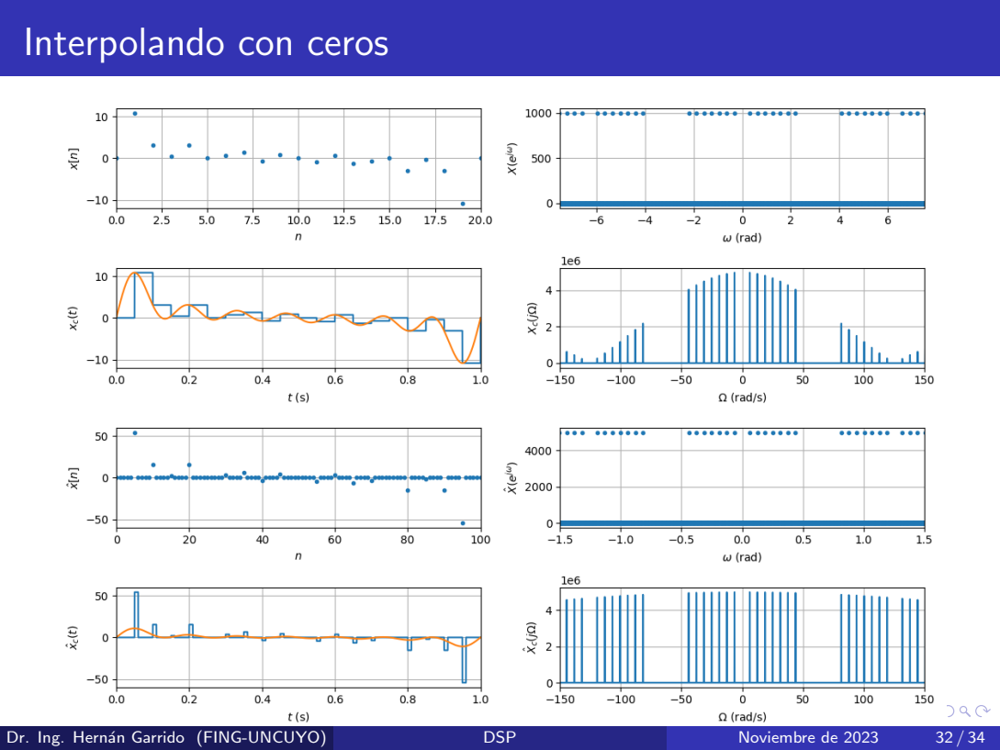

Al aplicar un filtro digital Butterworth de octavo orden después de insertar los ceros, se atenúan las imágenes espectrales y la señal interpolada se aproxima mejor a la señal original.

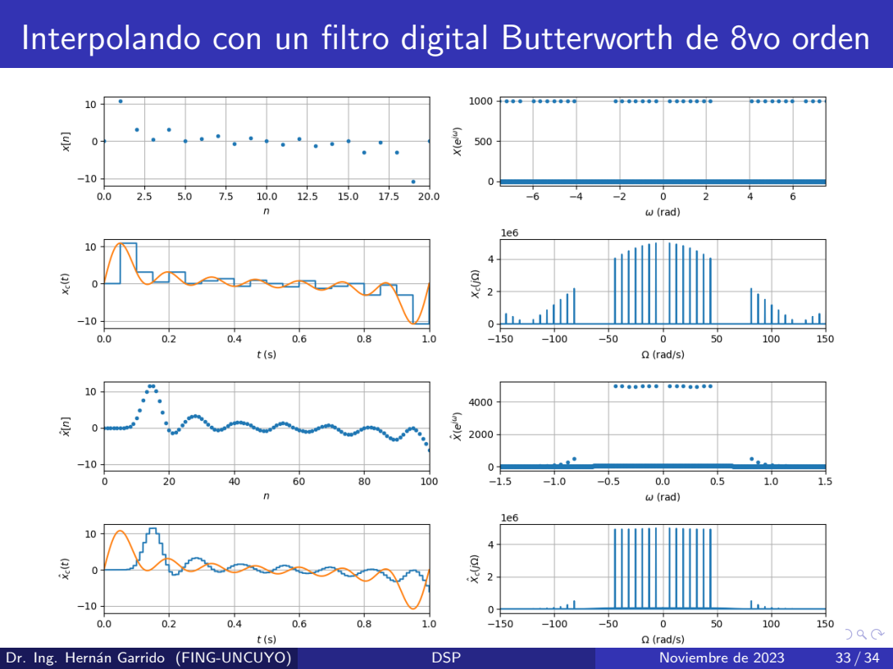

## Bibliografía

1. Alan V. Oppenheim y Ronald W. Schafer. *Discrete-Time Signal Processing*, 3.ª ed. Prentice Hall, 2010, sección 4.3.
2. Steven W. Smith. *The Scientist and Engineer's Guide to Digital Signal Processing*, capítulo 3, ADC and DAC. [DSP Guide](https://www.dspguide.com/).
3. Maxim Integrated. *Equalizing Techniques Flatten DAC Frequency Response*. Application Note 3853, agosto de 2012.
